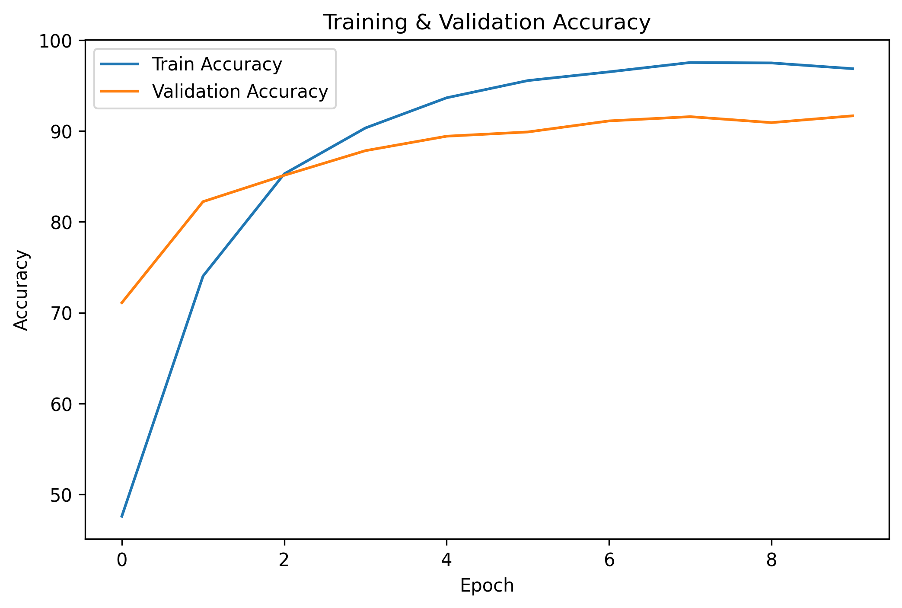
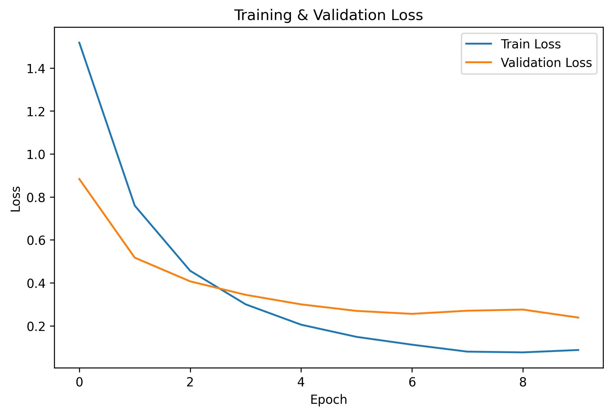
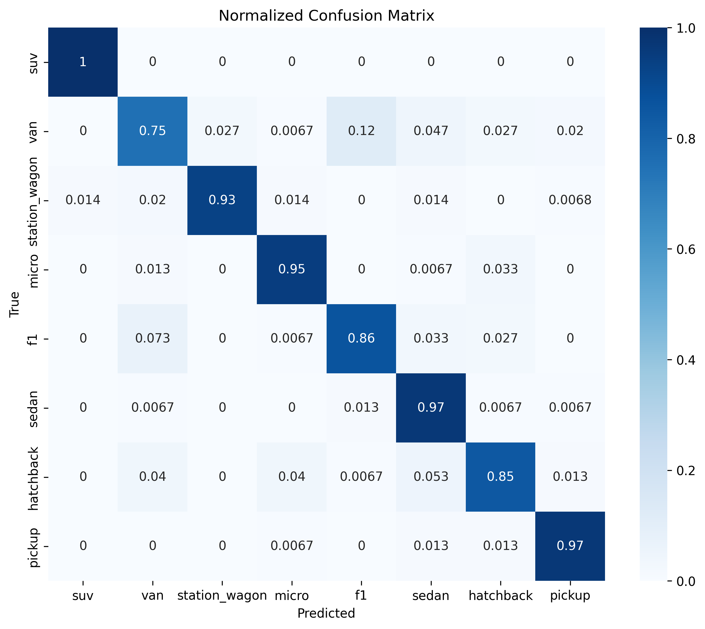

# 🚘 AI Car Body Classifier (Araba Gövde Tipi Sınıflandırma)

Yapay zeka tabanlı bu proje, farklı araba gövde tiplerini görüntüler üzerinden otomatik olarak sınıflandırabilen derin öğrenme tabanlı bir sistemdir. Çeşitli açık kaynaklardan derlenen özelleştirilmiş veri seti üzerinde ön işleme ve veri artırma (Data Augmentation) adımları uygulanmış, transfer öğrenme (Transfer Learning) yaklaşımıyla optimize edilen bir model eğitilmiştir. Eğitilen model, kullanıcıların gerçek zamanlı tahminler alabileceği modern bir **Streamlit** web arayüzüne entegre edilmiştir.

## 🎯 Projenin Amacı ve Kapsamı
Otomotiv sektöründe araçların otomatik tanınması; akıllı ulaşım sistemleri, trafik yönetimi ve güvenlik uygulamaları açısından kritik bir yere sahiptir. Bu çalışmada, birbirine yapısal olarak benzeyen veya tamamen ayrışan toplam **8 farklı araç sınıfı** yüksek doğrulukla sınıflandırılmaktadır:
1. SUV
2. Van
3. Station Wagon
4. Micro
5. Açık Tekerlekli (F1)
6. Sedan
7. Hatchback
8. Pick Up

## 🛠️ Teknik Mimari ve Kullanılan Teknolojiler
* **Ana Dil:** Python
* **Derin Öğrenme Framework'ü:** PyTorch, Torchvision
* **Model Mimarisi:** EfficientNet-B0 (Pre-trained on ImageNet)
* **Veri Ön İşleme:** Scikit-Learn, Pandas, NumPy
* **Görselleştirme:** Matplotlib, Seaborn
* **Web Arayüzü:** Streamlit
* **Geliştirme Ortamı:** Google Colab (T4 GPU), VS Code

## 🧬 Veri Ön İşleme ve Eğitim Detayları
* **Görsel Boyutlandırma:** Giriş görüntüleri EfficientNet mimarisine uygun olarak `224x224` boyutuna getirilmiş ve ImageNet standartlarında normalize edilmiştir.
* **Veri Artırma (Data Augmentation):** Modelin farklı açılardan ve ışık koşullarından etkilenmemesi için *rastgele yatay çevirme*, *rastgele döndürme* ve *parlaklık/kontrast değişiklikleri* uygulanmıştır.
* **Eğitim Parametreleri:** 
  * **Kayıp Fonksiyonu:** CrossEntropyLoss
  * **Optimizasyon Algoritması:** Adam (`lr=0.0001`)
  * **Grup Boyutu (Batch Size):** 32
  * **Erken Durdurma (Early Stopping):** Doğrulama kaybı (Validation Loss) 3 epoch boyunca iyileşmediğinde overfitting'i önlemek adına eğitim otomatik olarak durdurulmaktadır.

## 📊 Deneysel Sonuçlar ve Performans Grafikleri

Model, bağımsız test veri kümesi üzerinde değerlendirildiğinde **%91 genel doğruluk (Accuracy)** oranına ulaşmıştır.

### 1. Eğitim ve Doğrulama Doğruluk (Accuracy) Grafiği
Eğitim doğruluğu sürekli artış göstererek %98.2 seviyesine ulaşırken, doğrulama doğruluğu %94.1 seviyesinde zirve yapmıştır. İki eğri arasındaki farkın düşük olması modelin güçlü bir genelleme yeteneğine sahip olduğunu göstermektedir.



### 2. Eğitim ve Doğrulama Kayıp (Loss) Grafiği
Eğitim kaybı düzenli olarak azalarak 0.06 seviyesine düşmüştür. Doğrulama kaybında dramatik bir yükseliş olmaması, overfitting probleminin başarıyla önüne geçildiğini kanıtlamaktadır.



### 3. Sınıf Bazlı Performans ve Karışıklık Matrisi (Confusion Matrix)
* **F1 ve Station Wagon:** %100 doğruluk payı ile kusursuz sınıflandırılmıştır.
* **Sedan & SUV:** Sırasıyla %89 ve %87 doğruluk oranlarına sahiptir. Yüksek gövde yapıları ve tasarımsal benzerlikler nedeniyle kendi aralarında çok düşük oranda karışıklıklar gözlenmiştir.
* **Hatchback:** %86 oranla en çok Sedan ve Station Wagon sınıflarıyla yapısal benzerlikten dolayı karıştırılmıştır.



## 💻 Web Arayüzü Uygulaması (Streamlit)
Geliştirilen kullanıcı arayüzü sayesinde, kullanıcılar sürükle-bırak yöntemiyle herhangi bir araba görselini sisteme yükleyebilir. Model, görseli arka planda ön işlemeden geçirerek **tahmin edilen sınıfı, sınıf kodunu, güven skorunu (Confidence) ve tahmin süresini** saniyeler içinde dinamik bir bar grafik eşliğinde ekrana yansıtır.

## 🚀 Projeyi Yerelde Çalıştırma

1. Projeyi klonlayın:
```bash
git clone [https://github.com/ustuniclall/Araba-Govde-Tipi-Siniflandirma.git](https://github.com/ustuniclall/Araba-Govde-Tipi-Siniflandirma.git)
cd Araba-Govde-Tipi-Siniflandirma
```

## 👥 Geliştiriciler
* **Merve Kübra ÖZTÜRK**
* **İclal ÜSTÜN**
